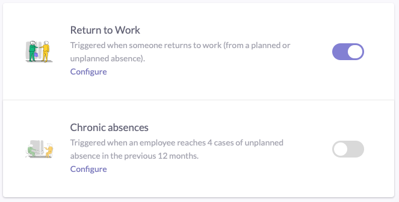
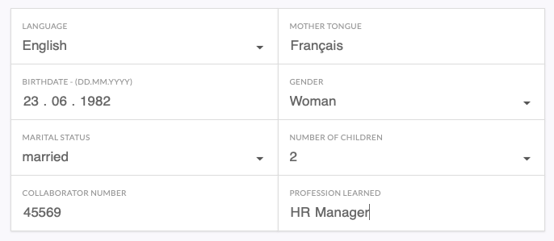
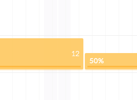

 

    

 

Biings Developer Guide

Integrate Biings with the softwares already deployed in your company.

    

    

    

        

        

            

                
Integration Doc

                
Integrate and synchronise your app with Biings

            

        

        

        

                <a href="#/integration" class="button is-rounded is-glowing is-dark is-beefy">Get started</a>
        

    

    

        

            

                
Host Biings on your server

                
On-premises install requirements

            

        

        

            <a href="#/server" class="button is-rounded is-beefy">Learn more</a>
        

    

<h2 class="title is-3 has-text-centered is-family-secondary has-text-weight-medium has-text-dark">Enable sustainable HR habits</h2>

    

    

        

            
Create follow-up worklows

            Tell Biings who is the manager of who to enable meaningfull absence management workflows.
            

            Learn about <a href="#/integration?id=relations">Occupations</a>
        

    

    
 

    

        

            
Automate claim reports

            Automaticaly fill illness or accident claim reports by incorporating employee details.
            

            Learn about <a href="#/integration?id=persons">Person details</a>
        

    

    

    
 

    

    

        

            
Consolidate absences

            Biings features an automatic absence linking algorythm that runs each time Biings has finished synchronizing with your data source.
            

            

Learn about [absence linking rules](autolinking)

        

    

 

    

            

                <a href="#/apps" class="">
                    
Compatible Apps

                    
Connect your favorite tools to your Biings account.

                </a>
            

    

    

        

            <a href="https://www.biings.com/faq.html" class="">
                
FAQ
 
                
Answers to frequently asked questions

            </a>
        

    

    

        

                
API
 
                
Connect with Biings directly Available Soon

        

    

Have a question?

Don't hestitate to <a href="tel:0041263215246">Call</a> or <a href="https://biings.com/contact">Contact Us</a>

